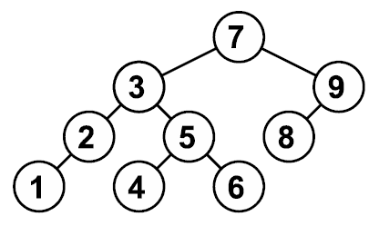

# [Структуры данных](https://informatics.msk.ru/course/view.php?id=18#section-2)

## Тема 2. Куча и приоритетная очередь.

### [Задача №1164. Увеличение приоритета](https://informatics.msk.ru/mod/statements/view.php?id=1234#1)

См. <a href="https://informatics.msk.ru/mod/resource/view.php?id=1230">«Двоичная куча (пирамида). Пирамидальная сортировка. Приоритетная очередь» (PDF)</a>, стр. 9, задача 1.

Ограничение времени – 2 секунды

[Решение python](./topic_2/task_1164_increment.py)

### [Задача №1165. Уменьшение приоритета](https://informatics.msk.ru/mod/statements/view.php?id=1234&chapterid=1165#1)

См. <a href="https://informatics.msk.ru/mod/resource/view.php?id=1230">«Двоичная куча (пирамида). Пирамидальная сортировка. Приоритетная очередь» (PDF)</a>,, стр. 10, задача 2.

Ограничение времени – 2 секунды

[Решение python](./topic_2/task_1165_decrement.py)

### [Задача №1166. Извлечение максимального](https://informatics.msk.ru/mod/statements/view.php?chapterid=1166#1)
См. <a href="https://informatics.msk.ru/mod/resource/view.php?id=1230">«Двоичная куча (пирамида). Пирамидальная сортировка. Приоритетная очередь» (PDF)</a>, стр. 10, задача 3.

Ограничение времени – 1 секунда

[Решение python](./topic_2/task_1166_extract_max.py)

### [Задача №1167. Приоритетная очередь](https://informatics.msk.ru/mod/statements/view.php?id=1234&chapterid=1167#1)
См. <a href="https://informatics.msk.ru/mod/resource/view.php?id=1230">«Двоичная куча (пирамида). Пирамидальная сортировка. Приоритетная очередь» (PDF)</a>, стр. 11, задача 4.

Ограничение времени – 2 секунды

[Решение python](./topic_2/task_1167_priority_queue.py)

### [Задача №1168. Приоритетная очередь с удалением](https://informatics.msk.ru/mod/statements/view.php?id=1234&chapterid=1168#1)
См. <a href="https://informatics.msk.ru/mod/resource/view.php?id=1230">«Двоичная куча (пирамида). Пирамидальная сортировка. Приоритетная очередь» (PDF)</a>, стр. 12, задача 5.

Ограничение времени – 2 секунды

[Решение python](./topic_2/task_1168_priority_queue_with_removal.py) _Пройдены не все тесты!_

### [Задача №1169. Построение кучи просеиванием вверх](https://informatics.msk.ru/mod/statements/view.php?id=1234&chapterid=1169#1)
См. <a href="https://informatics.msk.ru/mod/resource/view.php?id=1230">«Двоичная куча (пирамида). Пирамидальная сортировка. Приоритетная очередь» (PDF)</a>, стр. 13, задача 6.

Ограничение времени – 1 секунда

[Решение python](./topic_2/task_1169_build_heap_shift_up.py)

### [Задача №1170. Построение кучи просеиванием вниз](https://informatics.msk.ru/mod/statements/view.php?id=1234&chapterid=1170#1)
См. <a href="https://informatics.msk.ru/mod/resource/view.php?id=1230">«Двоичная куча (пирамида). Пирамидальная сортировка. Приоритетная очередь» (PDF)</a>, стр. 13, задача 7.

Ограничение времени – 1 секунда

[Решение python](./topic_2/task_1170_build_heap_shift_down.py)

В первой реализации (на основе просеивания вверх) выполняется много просеиваний на большую глубину, и мало просеиваний на маленькую глубину. Во второй реализации, наоборот, просеиваний на большую глубину выполняется мало, а на маленькую – много. Поэтому разумно предположить (и можно доказать), что вторая реализация работает быстрее.

Можно доказать (см. например, книгу Кормена и др.), что вторая реализация (на основе просеивания вниз) всегда работает за время $\Theta(n)$, а первая в худшем случае – за $\Theta(n \log{n})$. 

### [Задача №1171. Пирамидальная сортировка - подробно](https://informatics.msk.ru/mod/statements/view.php?id=1234&chapterid=1171#1)
См. <a href="https://informatics.msk.ru/mod/resource/view.php?id=1230">«Двоичная куча (пирамида). Пирамидальная сортировка. Приоритетная очередь» (PDF)</a>, стр. 13, задача 8.

Ограничение времени – 1 секунда

[Решение python](./topic_2/task_1171_detailed_pyramid_sort.py)

Сортировка кучей или пирамидальная сортировка заключается в следующем. В куче в корне находится ее максимальный элемент. Он заменяется с последним эелементом кучи $n$. Далее выполняется восстановление кучи с элементами $[1; n)$ просейванием вниз (т.е. до максимального элемента в конце кучи). Далее элемент $n - 1$ заменяется с первым элементом и выполняется операция просеивания кучи с элементами $[1; n - 1)$. И так далее. В итоге мы получим отсортированный по возрастанию массив.

### [Задача №1172. Просто сортировка](https://informatics.msk.ru/mod/statements/view.php?id=1234&chapterid=1172#1)
См. <a href="https://informatics.msk.ru/mod/resource/view.php?id=1230">«Двоичная куча (пирамида). Пирамидальная сортировка. Приоритетная очередь» (PDF)</a>, стр. 14, задача 9.

Ограничение времени – 1 секунда

[Решение python](./topic_2/task_1172_pyramid_sort.py) _Пройдены не все тесты! Превышено максимальное время работы._

## Тема 3. Двоичное дерево поиска.

Бинарное дерево позволяет искать элемент по значению и добавлять новый элемент за $\Theta(\log{n})$. Основоное свойство бинарного дерева: правый ребенок больше родителя, а левый - меньше (в отличии от кучи, когда основное свойство кучи - родитель больше детей).

### [Задача №757. Высота дерева](https://informatics.msk.ru/mod/statements/view.php?id=599#1)
Реализуйте бинарное дерево поиска для целых чисел. Программа получает на вход последовательность целых чисел и строит из них дерево. Элементы в деревья добавляются в соответствии с результатом поиска их места. Если элемент уже существует в дереве, добавлять его не надо. Балансировка дерева не производится.

**Входные данные**
На вход программа получает последовательность натуральных чисел. Последовательность завершается числом 0, которое означает конец ввода, и добавлять его в дерево не надо.

**Выходные данные**
Выведите единственное число – высоту получившегося дерева.

</img>

[Решение python](./topic_3/task_757_tree_height.py) _Пройдены не все тесты! Превышено максимальное время работы._

### [Задача №758. Количество элементов](https://informatics.msk.ru/mod/statements/view.php?id=599&chapterid=758#1)
Подсчитайте количество элементов в получившемся дереве и выведите это количество.

**Входные данные**
Вводится последовательность целых чисел, оканчивающаяся нулем. Сам ноль в последовательность не входит.

**Выходные данные**
Выведите ответ на задачу.

[Решение python](./topic_3/task_758_quantity_of_elements.py) _Пройдены не все тесты! Превышено максимальное время работы._

### [Задача №759. Второй максимум](https://informatics.msk.ru/mod/statements/view.php?id=599&chapterid=759#1)
Выведите второй по величине элемент в построенном дереве. Гарантируется, что такой найдется.

**Входные данные**
Дана последовательность целых чисел, оканчивающаяся нулем. Сам ноль в последовательность не входит.

**Выходные данные**
Выведите ответ на задачу.

[Решение python](./topic_3/task_759_second_max.py) _Пройдены не все тесты! Превышено максимальное время работы._

### [Задача №760. Обход](https://informatics.msk.ru/mod/statements/view.php?id=599&chapterid=760#1)
Выведите все элементы полученного дерева в порядке возрастания.

**Входные данные**
Вводится последовательность целых чисел, оканчивающаяся нулем. Сам ноль в последовательность не входит. По данной последовательности требуется построить дерево.

**Выходные данные**
Выведите ответ на задачу.

[Решение python](./topic_3/task_760_detour.py) _Пройдены не все тесты! Превышено максимальное время работы._
