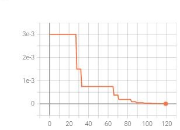
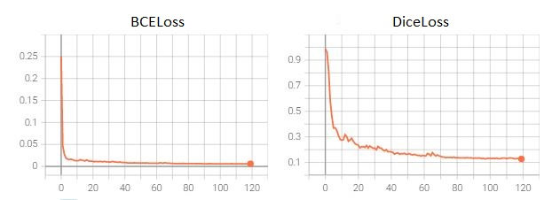
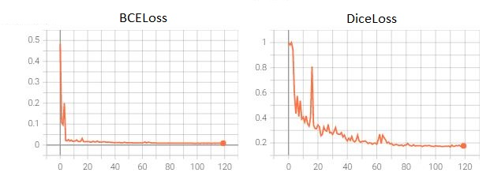

## Описание

В рамках тестового задания необходимо решить задачу сегментации плеврального выпота на снимках легких человека. Подробное описание тестового задания [здесь](./Description.md).

## Решение

### Анализ данных для обучения

Предоставленные данные - это 10-ть наборов медицинских снимков легких с номерами {1, 2, 5, 8, 13, 16, 18, 24, 26, 28} 10-ти пациентов размера 512 х 512. Каждый набор включает некоторое количество таких снимков и каждый снимок соответствует "срезу" туловища пациента. Для каждого набора имеется трехмерная маска со значениями {0, 1}, где 1 соответствует плевральному выпоту.

Информация по расположению файлов была агрегирована в [metadata.json](./data/metadata.json).

Ниже представлен пример снимков {0, 5, 10, 15, 20, 25, 30, 35, 40, 45} для пациента 26. Синим цветом обозначен ground truth для соответствующего среза.

</img>

Диаграмма распределения плеврального выпота вдоль размерности 0 (вдоль координаты "Z") для каждого набора снимков (обозначено цветом):

</img>

Диаграмма распределения плеврального выпота вдоль размерностей 1 и 2 (вдоль координат "Y" и "X" соответственно) для каждого набора снимков (обозначено цветом):

</img>

Как видно из диаграмм, класс 1, соответствующий плевральному выпоту, находится преимущественно в диапазоне [0, 85] для размерности 0 ("Z"), [250, 400] для размерности 1 ("Y") и [100, 400] для размерности 2 ("X").

### Выбор подхода для решения поставленной задачи

Для решения поставленной задачи решено использовать модель `Unet++` с `resnet34` в качестве энкодера. Данная модель, хоть и не является SOTA для такого рода задач, но вполне достаточна для демонстрации умений в рамках тестового задания и была выбрана с целью минимизации времени обучения. Для использования других архитектур достаточно указать необходимую модель в [конфигурационном файле](./config.yaml).

Модель обучалась только на 2-х мерных срезах вдоль размерности 0 (ось "Z").

### Аугментация данных

В силу малого объема данных для обучения модели необходима аугментация данных. Для аугментации данных использовались следующие шаги:
1. Вращение 3-х мерного тезора размера N х 512 х 512 относительно осей "Y" и "X" (размерности 1 и 2 соответственно), где N - количество срезов вдоль размерности 0 (ось "Z") для набора снимков пациента. Вращение осуществлялось случайным образом относительно центра среза, к которому применялась аугментация.
2. После вращения 3-х мерного тезора размера N х 512 х 512 относительно осей "Y" и "X" двухмерный срез размера 512 х 512, для которого производилась аугментация, отделялся от остальных срезов. Дальнейшие шаги по аугментации производились только с этим 2-х мерным срезом.
3. Вращение 2-х мерного среза на случайный угол из промежутка [-15, 15].
4. Случайная обрезка изображения. Размер итогового изображения 408 х 408.
5. Отражение относительно вертикальной оси.

Шаги {1, 3, 4, 5} применялись с вероятностями `p_3drot`, `p_2drot`, `p_rcrop`, `p_hflip` соответственно. Значения данных вероятностей указываются в [конфигурационном файле](./config.yaml), или если не указано, то используется `default` значение (см. DataSetConfig в файле [utils.py](./aidiagnostic/utils.py)). При решении данной задачи для уменьшения времени обучения `p_3drot` было выставлено равным 0.

Далее размер среза уменьшался до размера 224 х 224 и нормализовался. Также дублировался единственный канал до 3-х, с целью использования предобученной на `imagenet` модели. Итоговое количество каналов также может быть указано в [конфигурационном файле](./config.yaml). Описанные шаги аугментации можно посмотреть в методе `transform` класса `AiDiagnosticDataset` в файле [dataset.py](./aidiagnostic/dataset.py).

### Запуск процесса обучения

Модель обучалась на 120 эпохах с изначальным значением скорости обучения 3e-3. При достижении значения функции потерь плато продолжительностью в 4-ре эпохи, скорость обучения уменьшалась вдвое. Использовались функции потерь `DiceLoss` и `BCEWithLogitsLoss`.

Для удобства обучения модели был написан [скрипт](./aidiagnostic_go.py). Для запуска обучения модели необходимо выполнить команду:

```bash
python aidiagnostic_go.py
```

Ниже представлены опции:

```bash
--device                указывается на чем обучать модель, "cuda" (по умолчанию) или "cpu"
--dice                  если указано, то рассчитывать dice loss
--bce                   если указано, то рассчитывать bce loss
--lr                    начальная скорость обучения, по умолчанию 3e-3
--patience              кличество эпох, после которых если не произошло суммарное уменьшение функции потерь, то производится
                        уменьшение скорости обучение, по умолчанию 10
--factor                коэфициент, на который домножается значение скорости обучения, по умолчанию 0.1
--writer-path           путь, в который записываются логи для tensorboard, по умолчанию "./runs/"
--model-loc             путь, в который сохраняется обученная модель, по умолчанию None (т.е. без сохранения модели)
--config-loc            путь к конфигурационному файлу, по умолчанию "./config.yaml"
-ts, --train-size       размер тренировочной выборки, по умолчанию 0.8
-e, --epochs            количество эпох, по умолчанию 40
```

Для обучения модели были применены следующие опции:

```bash
python aidiagnostic_go.py --dice --bce --writer-path "../drive/MyDrive/runs/" --model-loc "../drive/MyDrive/aidiagnostic_model.pth" --epochs 120 --patience 4 --factor 0.5
```

Описание параметров конфигурационного файла:
* `model`

```txt
encoder_name            имя энкодера модели, по умолчанию "resnet34"
encoder_weights         веса предобученной модели, по умолчанию "imagenet"
in_channels             количество каналов исходного изображения, по умолчанию 3
classes                 количество классов, по умолчанию 1
```

* `dataloader`

```txt
batch_size              см. [torch.utils.data.DataLoader](https://pytorch.org/docs/stable/data.html#torch.utils.data.DataLoader), по умолчанию 64
num_workers             см. [torch.utils.data.DataLoader](https://pytorch.org/docs/stable/data.html#torch.utils.data.DataLoader), по умолчанию 4
pin_memory              см. [torch.utils.data.DataLoader](https://pytorch.org/docs/stable/data.html#torch.utils.data.DataLoader), по умолчанию True
```

* `dataset`

```txt
metadata_loc            путь к файлу с метадатой данных для обучения, по умолчанию "./data/metadata.json"
transform               True если необходимо производить трансформацию исходных данных, по умолчанию True
crop_size               размер итогового изображения после трансформаций, по умолчанию 224
in_channels             количество каналов в итоговом изображении после трансформаций, по умолчанию 3
loc                     лист средних значений по каждому каналу для нормализации. Если None, то средние рассчитываются по текущему 
                        изображению, по умолчанию None
scale                   лист значений стандартного отклонения по каждому каналу для нормализации. Если None, то стандартные отклонения 
                        рассчитываются по текущему изображению, по умолчанию None
p_3drot                 вероятность применения вращения 3D тензора, по умолчанию 0.5
p_2drot                 вероятность применения вращения двумерного изображения, по умолчанию 0.5
p_rcrop                 вероятность обрезки изображения, по умолчанию 0.9
p_hflip                 вероятость отражения изображения относительно вертикальной оси, по умолчанию 0.5
```

### Результаты

На момент 57-ой эпохи из 120 имеются следующие результаты:

Лучшие значения функций потерь на валидационной выборке (57-я эпоха):
- BCELoss:    0.0074
- DiceLoss:   0.1890

Ниже представлены графики с `tensorboard`:

**Learning Rate**

</img>

**Значения BCELoss и DiceLoss на тренировочной выборке**

</img>

**Значения BCELoss и DiceLoss на валидационной выборке**

</img>

### Выводы

В рамках решения тестового задания была обучена модель `Unet++` с `resnet34` в качестве энкодера для обнаружения плеврального выпота (2D архитектура). Результаты представлены в предыдущем разделе.

Выполнены требования к тестовому заданию:
- **файл с архитектурой модели**. Использовалась предобученная на `imagenet` модель `Unet++` с `resnet34` в качестве энкодера из `segmentation_models_pytorch`.
- **файл с препроцессингом данных для обучения** - см. класс `AiDiagnosticDataset` в [файле](./aidiagnostic/dataset.py).
- **файл с датасетом** - см. класс `AiDiagnosticDataset` в [файле](./aidiagnostic/dataset.py). Также был собран [файл](./data/metadata.json) с метаданными данных для обучения.
- **файл с функцией подсчета [DICE Coef](https://radiopaedia.org/articles/dice-similarity-coefficient#:~:text=The%20Dice%20similarity%20coefficient%2C%20also,between%20two%20sets%20of%20data.)** - использовалась готовая реализация подсчета DiceLoss из `segmentation_models_pytorch.losses`.
- **основной файл с самим циклом обучения. В коде обучения во время валидации автоматически должна  выбираться лучшая эпоха и сохраняться веса модели в папку `output`. Также после цикла обучения в эту папку должна сохраняться картинка с изменениями коэффициента DICE с каждой эпохой. (по оси Y - коэффициент DICE, по оси X - номер эпохи). Вместо выходной картинки с графиком можно использовать любые трекеры при желании (tensorboard etc.)** - см. [файл](./aidiagnostic_go.py) и [файл](./aidiagnostic/train.py). Изменение DiceLoss в процессе обучения представлено в предыдущем разделе.

