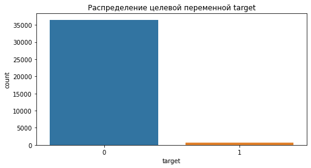

В данном разделе представлено решение тестового задания для кандидата на позицию ds в BankCenterCredit. Тестовое задание состоит из двух частей:
- написание SQL запросов
- построение модели кредитного скоринга

**Первая часть** тестового задания представлена в файле [sql_queries.md](sql_queries.md)

**Вторая часть** подробно представлена в ноутбуке [scoring_model.ipynb](scoring_model.ipynb). Помимо этого главные тезисы решения второй части представлены в разделе **Задание по моделированию** ниже.

Само тестовое задание можно найти по [ссылке](data/%D0%97%D0%B0%D0%B4%D0%B0%D1%87%D0%B8%20%D0%B4%D0%BB%D1%8F%20%D0%BA%D0%B0%D0%BD%D0%B4%D0%B8%D0%B4%D0%B0%D1%82%D0%BE%D0%B2.xlsx)

# Задание по моделированию

В этом разделе представлены основные тезисы по второй части тестового задания. Подробный ход выполнения задания представлен в ноутбуке [scoring_model.ipynb](scoring_model.ipynb).

## Анализ исходных данных

### Анализ целевой переменной

</img>

По диаграмме выше можно отметить, что в данных присутствует существенный дисбаланс классов.

### Предобработка данных

В данном разделе описаны основные этапы предобработки данных

- заполнение пропущенных значений

В данных присутствуют пропущенные значения. Помимо пропущенных значений в данных присутствуют нулевые значения, которые для некоторых фичей (например для x_21) "напоминают" отсутствие каких либо данных. Пример приведен ниже (по оси абсциcc - логарифм значений переменной). Нулевые значения в таких случаях вызывают смещение распределения данных и как следствие, смещение предсказаний модели (особенно в случае использования линейных моделей). На основании вышеизложенного мною принято решение заменить все пропущенные значения на 0 и затем заменить нулевые значения (для такого рода фичей, как представлено на рисунке ниже) на медианное значение, при этом добавив дополнительную бинарную фичу, которая несет информацию о том, что для данного объекта в соответствующей колонке был указан 0, который впоследствии был заменен на медиану. Таким образом мы не теряем информацию и избегаем смещения.

</img>

- Обработка категориальных переменных

В данных по scatter plot можно выделить следующие категориальные переменные: x_1 (8 уникальных значений), x_4 (9 уникальных значений) и x_17 (19 уникальных значений). По графикам можно заметить, что у x_1 для одной из категорий в данных присутствует всего один объект 0-го класса. Следовательно эта категория никакой предсказательной силы не имеет и этот объект можно удалить (собственно как и категорию этого объекта). В x_17 визуально выделяется 5 категорий, вместо 19-ти. Используя KMeans "схлопнем" эти 19-ть категорий до 5-ти.

</img>

После закодируем эти три категориальные фичи с помощью one hot метода.

- удаление выбросов в колонках х_10, х_12, х_10

В данных колонка присутствует по одному объекту 0-го класса, которые имеют "экстремально" большие значения для значений из соответствующей колонки (пример для х_10 приведен ниже). Удалим такие объекты.

</img>

- разбиение данных из х_3 на классы

Интересно оказались распределены данные в колонке х_3. Визуально можно отметить некую границу, ниже которой большинство данных, а выше - данные, похожие на выбросы. Добавим дополнительную бинарную фичу, которая разделяет эти два класса значений.

</img>