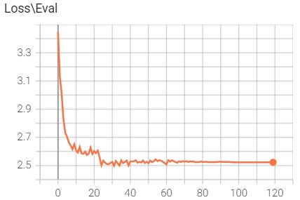

# Task description

Task is to train simple seq2seq RNN for english to russian translation.

# Architecture

Net consists of two simple 1-layer RNN with GRU cell for the encoder and for the decoder. Self attention approach didn't used. Words embeddings were randomly sampled. To avoid the exploding of the gradients gradient clipping with parameter c = 4 was used.

# Training process and final results

Model trained during 120 epochs. The training process are precisely shown at the images below.

     
    
    

