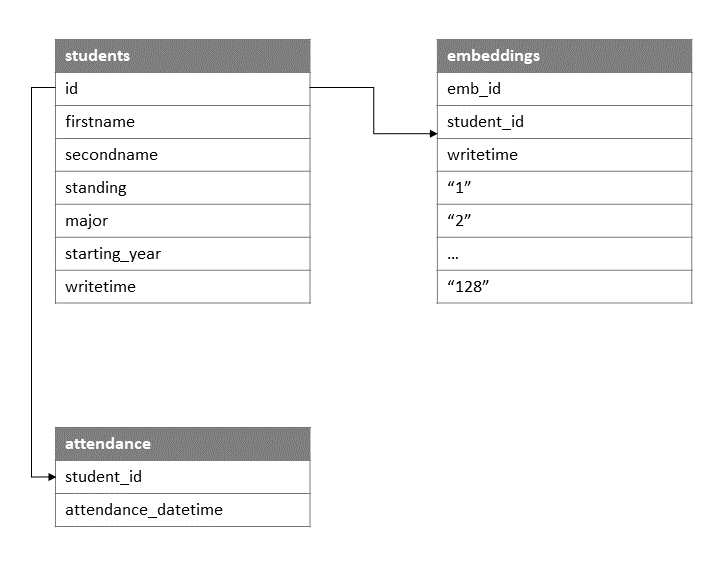
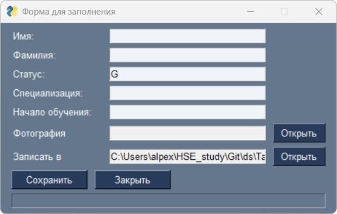

# Attendance System

## Задача

Необходимо разработать сервис для контроля посещаемости студентов. Контроль происходит в результате распознавания лица студента, посетившего занятие, и фиксацией факта посещения в базе `PostgreSQL`. Если с момента последней отметки в базе для данного студента прошло менее 30 минут, то повторно студент не отмечается.

## Схема базы данных PostgreSQL

Схема изображена ниже:

</img>

Таблица `students`:
- `id` - уникальный ID студента (primary key)
- `firstname` - имя студента
- `secondname` - фамилия студента
- `standing` - статус
- `major` - специальность
- `starting_year` - год начала обучения
- `writetime` - время записи значения в таблицу

Таблица `embeddings`:
- `emb_id` - уникальный ID эмбеддинга (primary key)
- `student_id` - уникальный ID студента (foreign key)
- `writetime` - время записи значения в таблицу
- `"1"` ... `"128"` - значения эмбеддинга

Таблица `attendance`:
- `student_id` - уникальный ID студента (foreign key)
- `attendance_datetime` - время посещения

Для создания таблиц необходимо:
1. В [.env](.env) указать строку подключения к PostgreSQL
2. Запустить скрипт dp.py. Например:
```bash
python db.py --hidden 128 --force
```

Если указать флаг `--force`, то таблицы пересоздадутся (если уже имеются в базе). `--hidden` - это размерность эмбеддинга лица (default 128).

## Добавление нового студента в базу

Добавить студента (с эмбеддингом лица) в базу можно через форму ниже:

</img>

Которая запускается с помощью скрипта:

```bash
python fill_meta.py
```

Значения полей:

- `Имя` - имя студента
- `Фамилия` - фамилия студента
- `Статус` - статус студента
- `Специализация` - специализация студента
- `Начало обучения` - год начала обучени студента (4-ре цифры)
- `Фотография` - путь к фотографии студента (выбирается с помощью кнопки `Открыть`)
- `Записать в` - путь, куда записать распознанное лицо (фрагмент фотографии с лицом) студента (выбирается с помощью кнопки `Открыть`, default значение уже указано в форме). Если на фотографии присутствует более 1-го лица, то система выберет лицо, занимающее максимальную площадь на фотографии.

## Результаты

Для запуска скрипта по контролю посещаемости необходимо запустить скрипт `main.py`. Результаты ниже:

</img>

Система знает:
- меня
- Илона Маска
- Эмили Блант

Тома Круза она не знает, поэтому Том Круз отмечен как Unknown.