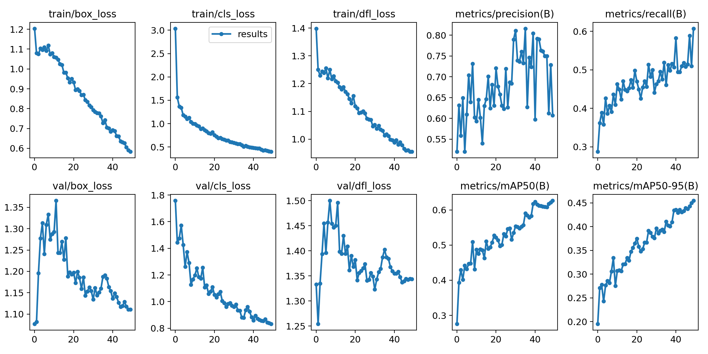
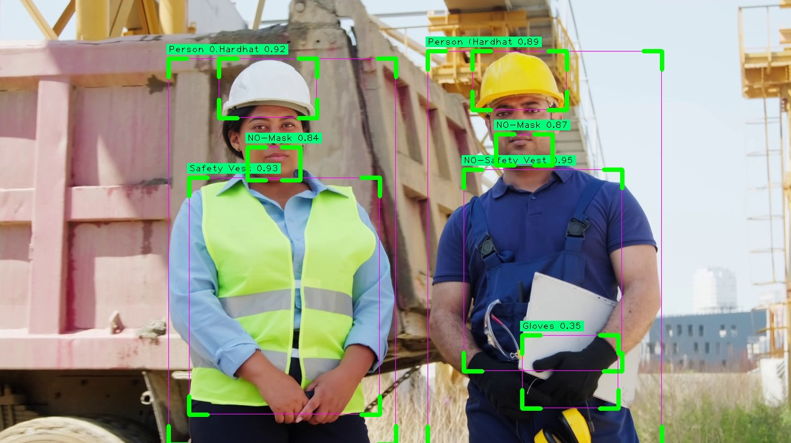

# Описание задачи

Необходимо решить задачу детекции объектов на изображении / видео:
- Есть / нет каски
- Есть / нет сигнального жилета
- Есть / нет маски на лице
- и т.д.

# Модель

Для решения данной задачи решено использовать модель [YOLOv8](https://github.com/ultralytics/ultralytics)

# Датасет

Для обучения модели YOLOv8 использован датасет [Construction Site Safety](https://universe.roboflow.com/roboflow-universe-projects/construction-site-safety)

# Процесс обучения модели

Модель обучалась на 50-ти эпохах в Google Colab. Процесс обучения детализирован на рисунке ниже:

Судя про графикам, модель можно было обучать дальше, но решено остановиться на достигнутом результате с целью экономии ресурсов.

# Результаты

Стоп кадр из видео с детекциями

