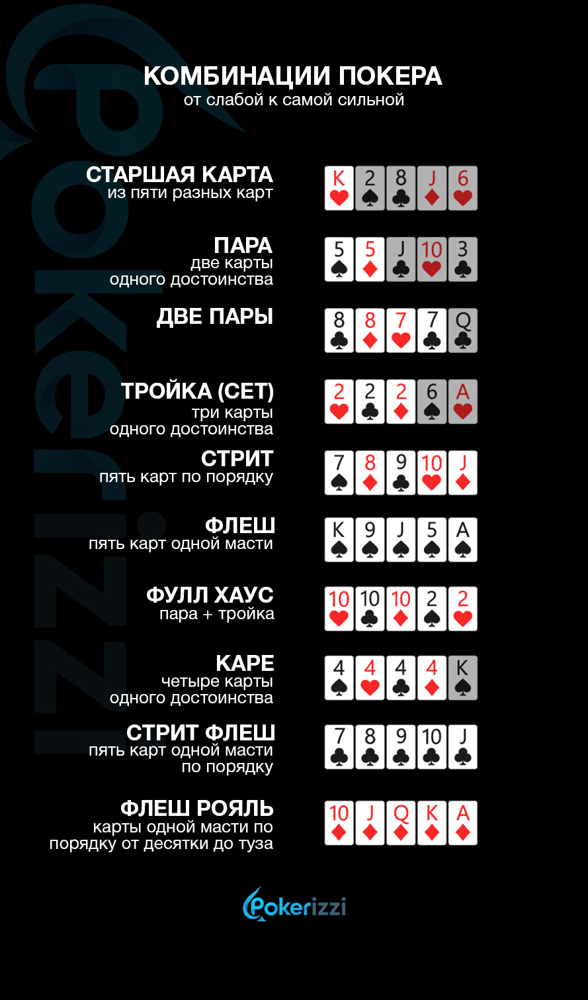

# Описание задачи

Необходимо решить задачу определения лучшей комбинации в покере, которая в данный момент находится на руках.

Комбинации в покере:

# Модель

Для решения данной задачи решено использовать модель [YOLOv8](https://github.com/ultralytics/ultralytics)

# Датасет

Для обучения модели YOLOv8 использован датасет [Playing Cards Image Dataset](https://universe.roboflow.com/augmented-startups/playing-cards-ow27d)