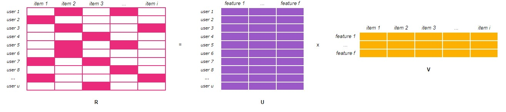

# ALS Implicit Collaborative Filtering

## Обзор

Мы напишем простую реализацию неявного рекомендательного алгоритма. Мы хотим находить похожие позиции и делать рекомендации нашим пользователям. Я сфокусируюсь на теории, некоторой части математики и на реализации python кода.

Так как мы разгоавриваем на тему коллаборативной фильтрации, то нас беспокоют только позиции (товары, к примеру), пользователи и то, как пользователи взаимодействуют с позициями.

## Неявные / Явные данные

В нашем случае явные данные это то, к примеру, какую оценку пользователи поставили фильмам в датасетах MovieLens или Netflix. То есть это нечто наподобие рейтинга. Мы знаем, как сильно пользователям нравится или не нравится позиция (к примеру, фильм). Иметь такого рода данные очень замечательно, но их непросто собрать или найти. Многие пользователи предпочитают не тратить время на расстановку рейтингов.

Неявные данные извлекаются из поведения пользователей, без расставления рейтингов или каких либо действий. Это могут быть данные рода: какие товары пользователь купил, как много раз пользователь прослушал / просмотрел ту или иную песню / фильм, как много времени пользователь потратил времени на прочтение той или иной статьи. Плюс - больше данных, минус - они шумные и не всегда соответствуют тому, что они действительно означают.

К примеру, с рейтингом мы знаем, что если пользователь поставил рейтинг 1, то это значит, что фильм пользователю не понравился. Если 5, то понравился. В случае с прослушанной песней факт того, что пользователь прослушал ее это не обязательно значит что она ему понравилась. А если песня не была прослушана, то это также не значит, что она пользователю не подходит, так как он попросту мог и не знать о ней.

Поэтому мы фокусируемся на том, что нам известно - на действия пользователя, и на нашей уверенности в том, нравится ему тот или иной товар, или нет. Мы можем, например, измерить, как часто он воспроизводит песню, и дать более высокую степень уверенности, если он прослушали ее 500 раз по сравнению с одним разом.

Неявные рекомендации занимают все большую часть рекомендательных систем, т.к. размер неявных данных растет. К примеру, изначальное соревнование NetFlix базировалось только на явных данных, но сейчас они все больше и больше базируются на неявных данных. То же самое происходит и с Hulu, Spotify, Etsy и т.д..

## Датасет

В рамках данной статьи мы будем использовать датасет lastfm, содержащий поведение более чем 360,000 пользователей. Датасет содержит ID пользователя, ID артиста, имя артиста и сколько раз данный пользователь прослушал данного артиста. Также имеется информаци о возрасте, поле, стране и т.д. для пользователя. Но сейчас эту информацию мы не будем использовать.

## Alternating Least Squares (ALS)

ALS это модель, которую мы будем использовать для настройки на наших данных и для поиска схожести. Но перед этим повторим азы - разложение матриц. Именно на этом и основывается алгоритм ALS.

### Разложение матриц

Идея основывается на том, чтобы взять большую матрицу (потенциально огромную) и разложить ее в более сжатое представление. Таким образом мы получим две матрицы меньших размерностей, чье произведение равно исходной матрице.

Когда мы говорим про коллаборативную фильтрацию для рекомендательных систем мы хотим решить проблему нашей исходной матрицы, имеющей миллионы различных значений. Но наши "предпочтения" не столь сложны. Даже если мы видим сотни товаров, они передают лишь несколько наших предпочтений (например, про фильмы - боевик / комедия, мрачный / позитивный, фильм на подумать, с открытой концовкой, с неочевидным сюжетом и т.д.). И мы можем использовать разложение матриц для того, чтобы математически уменьшить размерность нашей исходной матрицы "все пользователи - все позиции" к двум значительно меньшим матрицами - "все пользователи - предпочтения" и "все позиции - предпочтения". Размер "предпочтений" называется latent или hidden features и мы получаем их из наших данных.

Снижение размерности позволяет ускорить выполнение кода и также дает улучшение качества, т.к. мы находим скрытые полезные свойства товаров / фильмов и т.д.. По сути мы представляем пользователей в виде вектора предпочтений (например, Анна обожает комедии, поэтому комедиям в векторе Анны будет присвоено большее значение), и товары / фильмы также в виде вектора предпочтений (фичей, для фильма Схватка значения предпочтений "боевик" и "серьезный" будут иметь большие значения). Также это позволяет нам находить близкие по предпочтениям пользователей, пусть даже если у них нет общих просмотренных фильмов. Все это позволяет нам решить задачу рекомендаций.

Тут также стоить отметить, что мы не знаем, что за фичи алгоритм выделил.

### Разложение матриц, неявные данные

Существует несколько различных алгоритмов разложения матриц, таких как Singular Value Decomposition (SVD), или Probabilistic Latent Semantic Analysis (PLSA), если мы имеем дело с явными данными.

С неявными данными разница заключается в том, как мы решаем проблему пропущенных значений в очень разряженной матрице. Для явных данных мы обрабатываем их как неизвестные поля, которым мы должны будем присвоить некоторый рейтинг (к примеру). В случае с неявными данными пропуски также являются информацией о поведении пользователя. Это может быть, к примеру, что пользователю действительно не интересен фильм, и он его даже не открыл посмотреть. А может быть пользователь попросту не увидел его в списке. Т.е. нам нужно каким-то образом учиться в том числе на пропущенных данных.

### Назад к ALS

ALS - это итеративный алгоритм, где с каждой новой итерацией мы все ближе и ближе к нашей исходной матрице, т.е к нашим исходным данным. 

Мы имеем нашу исходную матрицу $R$ размера $u \times i$ с нашими пользователями и позициями (товарами / фильмами / и т.д.). На пересечении колонок и столбцов - информация о взаимодействии пользователей с позициями (переход по ссылке, время прочтения статьи или фильма, сам факт просмотра фильма и т.д.). И мы хотим решить задачу разложения исходной матрицы на две матрицы меньшей размерности: матрица "пользователи - фичи" $U$ размерности $u \times f$, и матрица "позиции - фичи" $V$ размерности $f \times i$. В этих двух матрицах содержится информация (веса) того, как пользователь / позиция соотностится с каждой фичей. Задача найти эти две матрицы, произведение которых дает исходную (максимально близко к исходной), т.е:

$$R \approx U \times V$$

