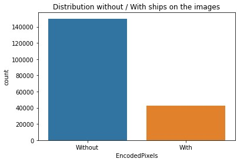
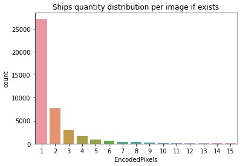
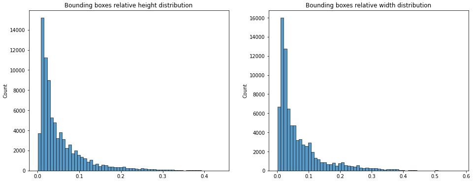
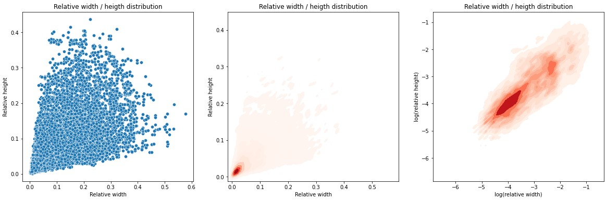
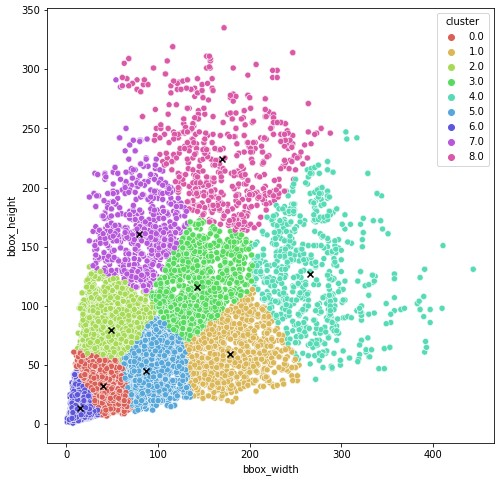
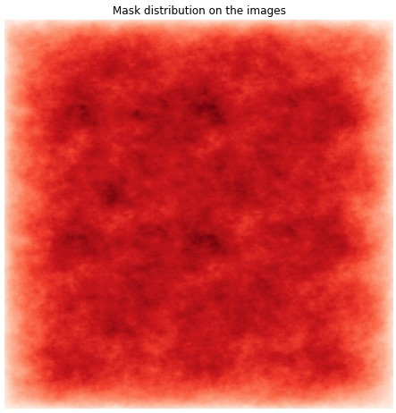

# Short competition description

Input data consists of satellite photos. On some photos ships are presented, on some not. Main task of the competition is to prepare the object detection algorithm to detect ships on satellite images.

# Input Data

The input data has been analysed. Below you can see the result of the analysis.

1. All images are size of 768x768
2. On most images there are no ships.

| Without |  With |
|:-------:|:-----:|
|  150000 | 42556 |

3. Below you can see the distribution of number of ships per image. As you can see, most of the images, which contains ships, has only one ship. Some images has more than 10 ships per image.

| Ships on image | Qantity of images |
|:--------------:|:-----------------:|
|        1       |       27104       |
|        2       |        7674       |
|        3       |        2954       |
|        4       |        1622       |
|        5       |        925        |
|        6       |        657        |
|        7       |        406        |
|        8       |        318        |
|        9       |        243        |
|       10       |        168        |
|       11       |        144        |
|       12       |        124        |
|       14       |         76        |
|       13       |         75        |
|       15       |         66        |

4. I'm going to use pretrained YOLOv7 for ships detection. It based on anchor approach and consists of 9 anchors. To achieve good quality it is necessary to fine tune anchor boxes size. YOLO algorithm has option to do it, but for the initial guess it's good to use KMean approach. 

Below you can find bounding boxes width and height distribution of training data and result of clusterization. Relative means that the bounding box size has been scaled to [0, 1] depends on image size where 1 - image size.

And finally the results of clustering. Crosses are the centroids of the clusters.

At the table below are presented coordinates of 9 centroids, scaled to [0, 1] depends on image size where 1 - image size.

|    Width   |   Height   |
|:----------:|:----------:|
| 0.05208766 | 0.04225233 |
| 0.23266494 | 0.07765489 |
| 0.06340369 |  0.1034118 |
| 0.18589801 | 0.15141759 |
| 0.34565368 | 0.16538194 |
| 0.11261608 | 0.05893354 |
| 0.01893375 | 0.01767838 |
| 0.10253858 | 0.20948272 |
| 0.22113875 | 0.29163192 |

5. All ship in input data has mask accordingly. Distribution of masks over images are presented on the diagram below. As you can see, it is distributed uniformly.

